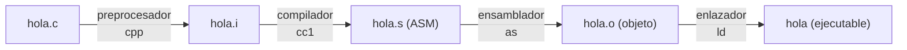

---
tags:
  - Fundamentos
  - C17
  - Compilación
---

# Capítulo 1 — Introducción al Lenguaje C

!!! abstract "Objetivos de aprendizaje"
    Al terminar este capítulo serás capaz de:

    - Situar C en su contexto histórico y entender su **filosofía de diseño**.
    - Instalar y verificar un *toolchain* completo (GCC/Clang/MSVC).
    - Explicar el **pipeline de compilación**: preprocesador → compilador →
      ensamblador → enlazador.
    - Escribir, compilar y ejecutar un programa con las firmas válidas de `main`.
    - Compilar desde la terminal con *flags* de calidad y un `Makefile` básico.

---

## 1.1 Historia y evolución de C

C nació en los **Bell Labs** entre 1969 y 1973 de la mano de **Dennis Ritchie**,
como evolución del lenguaje B de Ken Thompson, con un objetivo concreto y muy
pragmático: reescribir el sistema operativo **UNIX** en un lenguaje portable en
lugar de ensamblador. Ese origen explica casi todo lo que C es hoy: un lenguaje
**cercano al hardware**, con un *runtime* mínimo, pensado para escribir sistemas
operativos.

### La línea temporal de los estándares

| Hito | Año | Aporte clave |
|------|-----|--------------|
| **K&R C** | 1978 | El libro *The C Programming Language* de Kernighan y Ritchie define el lenguaje *de facto*. |
| **ANSI C / C89** | 1989 | Primera estandarización (ANSI X3.159). Prototipos de función. |
| **C90** | 1990 | ISO/IEC 9899:1990, idéntico a C89. |
| **C99** | 1999 | `//` comentarios, `long long`, `<stdint.h>`, VLAs, `inline`, `_Bool`, literales compuestos. |
| **C11** | 2011 | Hilos (`<threads.h>`), atómicos, `_Generic`, `_Static_assert`, anexos opcionales. |
| **C17** | 2018 | *Bugfix release* de C11; sin características nuevas. Es el **estándar por defecto recomendado**. |
| **C23** | 2024 | `true`/`false`/`bool` nativos, `nullptr`, `constexpr`, `typeof`, `[[attributes]]`, `_BitInt`, `#embed`. |

!!! note "¿Qué estándar usar en 2026?"
    Para producción estable, **C17** es la opción segura y universalmente
    soportada. **C23** (publicado oficialmente como ISO/IEC 9899:2024 en octubre
    de 2024) ya tiene soporte sólido en GCC 14+ y Clang 18+, y lo usaremos de
    forma marcada cuando aporte algo. Compila con `-std=c23` (o `-std=c2x` en
    compiladores algo más antiguos).

### Filosofía del lenguaje

Tres principios, heredados del *Spirit of C* recogido en el propio estándar:

1. **Confianza en el programador.** C no te impide hacer cosas peligrosas. Esto
   es a la vez su mayor fortaleza y la raíz de la mayoría de sus
   vulnerabilidades.
2. **Mínimo *runtime*.** No hay recolector de basura ni gestión automática de
   memoria. Lo que el programa hace, lo hace de forma explícita.
3. **Portabilidad.** El mismo código fuente compila en arquitecturas dispares,
   *si* respetas el estándar y evitas el *undefined behavior*.

---

## 1.2 Entorno de desarrollo

Si aún no tienes el *toolchain*, consulta la [guía de entorno](../guia/entorno.md).
El mínimo imprescindible es un compilador. Verifícalo:

```bash
gcc --version    # o clang --version
```

### Hello, World

El programa canónico, con el que arrancó toda una disciplina:

```c title="hola.c" linenums="1"
#include <stdio.h>   // (1)!

int main(void) {     // (2)!
    printf("Hola, mundo\n");  // (3)!
    return 0;        // (4)!
}
```

1. Directiva del preprocesador: incluye las declaraciones de la E/S estándar,
   entre ellas `printf`.
2. Punto de entrada del programa. `void` indica explícitamente que no recibe
   parámetros.
3. Imprime la cadena. `\n` es el salto de línea.
4. Código de salida `0` = éxito (convención POSIX).

```bash
gcc -std=c17 -Wall -Wextra -pedantic hola.c -o hola
./hola            # Hola, mundo
echo $?           # 0  → código de retorno de main
```

---

## 1.3 Estructura de un programa en C

### Directivas, funciones y la función `main`

Todo programa C ejecutable tiene exactamente **una** función `main`. El estándar
define dos firmas portables:

```c
int main(void);                      // sin argumentos
int main(int argc, char *argv[]);    // con argumentos de línea de comandos
```

- `argc` (*argument count*): número de argumentos, incluyendo el nombre del
  programa.
- `argv` (*argument vector*): array de cadenas; `argv[0]` es el nombre del
  ejecutable y `argv[argc]` es siempre `NULL`.

```c title="eco.c"
#include <stdio.h>

int main(int argc, char *argv[]) {
    for (int i = 0; i < argc; i++) {
        printf("argv[%d] = %s\n", i, argv[i]);
    }
    return 0;
}
```

```bash
./eco hola mundo
# argv[0] = ./eco
# argv[1] = hola
# argv[2] = mundo
```

### Declaraciones vs definiciones

Una distinción fundamental que arrastraremos todo el curso:

- Una **declaración** introduce un nombre y su tipo (promete que existe).
- Una **definición** además reserva almacenamiento o proporciona el cuerpo.

```c
extern int contador;   // declaración (existe en otro sitio)
int contador = 0;      // definición (reserva memoria)

int suma(int, int);    // declaración (prototipo)
int suma(int a, int b) { return a + b; }  // definición
```

### Comentarios

```c
// Comentario de línea (desde C99).
/* Comentario de bloque,
   puede ocupar varias líneas. */
```

---

## 1.4 Compilación desde la terminal

### El pipeline de compilación

Compilar un `.c` no es un paso único, sino **cuatro etapas**:



Puedes observar cada etapa por separado:

```bash
gcc -E hola.c -o hola.i      # 1. Solo preprocesador
gcc -S hola.i -o hola.s      # 2. Genera ensamblador
gcc -c hola.s -o hola.o      # 3. Ensambla a objeto
gcc hola.o -o hola           # 4. Enlaza (con libc)
```

### Flags esenciales

| Flag | Efecto |
|------|--------|
| `-std=c17` | Selecciona el estándar del lenguaje. |
| `-Wall -Wextra` | Activa los avisos importantes. |
| `-Wpedantic` | Exige conformidad estricta con el estándar. |
| `-O0`…`-O3`, `-Os` | Nivel de optimización (`-O0` para depurar). |
| `-g` | Incluye información de depuración (para GDB). |
| `-o nombre` | Nombre del archivo de salida. |
| `-fsanitize=address,undefined` | Instrumenta el binario para detectar errores en runtime. |

!!! tip "Tu comando de compilación por defecto"
    ```bash
    gcc -std=c17 -Wall -Wextra -Wpedantic -g \
        -fsanitize=address,undefined programa.c -o programa
    ```
    Trata cada *warning* como un error a investigar. La inmensa mayoría de los
    bugs serios de C empiezan siendo un aviso ignorado.

### Compilación separada y linking manual

Cuando un proyecto crece, cada `.c` se compila por separado a un `.o` y luego se
enlazan. Esto evita recompilar todo ante cada cambio:

```bash
gcc -c main.c -o main.o
gcc -c utils.c -o utils.o
gcc main.o utils.o -o programa
```

### Makefile básico

Automatizar lo anterior es el trabajo de `make`:

```makefile title="Makefile"
CC      := gcc
CFLAGS  := -std=c17 -Wall -Wextra -Wpedantic -g
OBJ     := main.o utils.o

programa: $(OBJ)
	$(CC) $(CFLAGS) $(OBJ) -o $@

%.o: %.c
	$(CC) $(CFLAGS) -c $< -o $@

clean:
	rm -f $(OBJ) programa

.PHONY: clean
```

```bash
make          # compila lo que haya cambiado
make clean    # limpia artefactos
```

---

## Conexión con la actualidad

C cumple **más de 50 años** y, lejos de ser una reliquia, es el **segundo o
tercer lenguaje más usado del mundo** en los índices TIOBE de 2024–2025. Tres
fuerzas lo mantienen vigente y, a la vez, bajo escrutinio:

- **El debate de la *memory safety*.** En 2023–2024, agencias como la **CISA**
  estadounidense y la **NSA** publicaron guías instando a migrar el software
  crítico desde lenguajes *memory-unsafe* (C y C++) hacia alternativas seguras
  como Rust. Lejos de matar a C, esto ha disparado el interés por **escribir C
  defensivo** (sanitizers, fuzzing, MISRA, CERT-C) — exactamente lo que enseña
  este curso en los capítulos 25 y 30.
- **C sigue siendo el sustrato.** El kernel de Linux, Git, SQLite, Redis, los
  intérpretes de Python y Ruby, FFmpeg y prácticamente todo *runtime* de
  lenguaje de alto nivel están escritos en C. Aprender C es aprender la *lingua
  franca* de los sistemas.
- **C23 moderniza el lenguaje.** La incorporación de `nullptr`, `constexpr`,
  `bool` nativo y `#embed` acerca C a la ergonomía moderna sin renunciar a su
  modelo de bajo nivel.

---

## Ejercicios

!!! example "Ejercicio 1.1 — Hola, mundo verificado ★"
    Escribe, compila y ejecuta el `Hola, mundo`. Comprueba con `echo $?`
    (Linux/macOS) o `echo $LASTEXITCODE` (PowerShell) que `main` devuelve 0.

!!! example "Ejercicio 1.2 — Códigos de retorno ★"
    Modifica `main` para que devuelva `42`. Verifica el código de salida. ¿Qué
    rango de valores es portable para el código de retorno? (Pista: POSIX usa el
    byte bajo, 0–255.)

!!! example "Ejercicio 1.3 — Leer al compilador ★★"
    Introduce deliberadamente tres errores: (a) olvida el `;`, (b) escribe
    `Printf` con mayúscula, (c) olvida el `#include`. Compila y **transcribe e
    interpreta** cada mensaje de error en tu bitácora.

!!! example "Ejercicio 1.4 — El pipeline al desnudo ★★★"
    Genera y abre `hola.i`, `hola.s` y `hola.o`. ¿Cuántas líneas tiene `hola.i`
    frente a `hola.c`? Localiza la instrucción `call` a `printf` en `hola.s`.

    ??? note "Pista"
        Usa `gcc -E`, `-S` y `-c`. Para inspeccionar el objeto:
        `objdump -d hola.o` o `nm hola.o`.

---

## Referencias

- Brian W. Kernighan, Dennis M. Ritchie. *The C Programming Language*, 2.ª ed.
  Prentice Hall, 1988. (El «K&R», canónico.)
- ISO/IEC 9899:2018 — *Programming languages — C* (C17). El estándar oficial.
- ISO/IEC 9899:2024 (C23). Borrador público **N3220**.
- [cppreference.com/w/c](https://en.cppreference.com/w/c) — referencia viva del lenguaje y la biblioteca estándar.
- [GCC Manual](https://gcc.gnu.org/onlinedocs/) — opciones del compilador.
