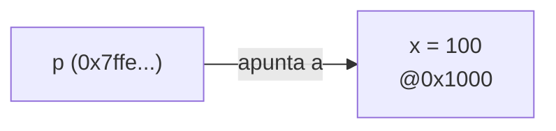

---
tags:
  - Intermedio
  - Punteros
---

# Capítulo 6 — Punteros

!!! abstract "Objetivos de aprendizaje"
    - Dominar `&` (dirección) y `*` (indirección).
    - Hacer **aritmética de punteros** correcta y segura.
    - Entender punteros a punteros, punteros `const`, `void *` y alineamiento.

!!! quote "El concepto central de C"
    Si entiendes los punteros, entiendes C. Si no, ningún otro capítulo te
    cuadrará. Tómate este con calma y mucho papel.

---

## 6.1 Conceptos fundamentales

Cada objeto vive en una **dirección** de memoria. Un **puntero** es una variable
que guarda una dirección.

```c
int x = 42;
int *p = &x;     // p guarda la dirección de x
printf("%d\n", *p);   // 42  → indirección: "el valor en esa dirección"
*p = 100;        // modifica x a través de p
```



El puntero nulo `NULL` (o `nullptr` en C23) indica «no apunta a nada». Desreferenciar
`NULL` es *undefined behavior* (en la práctica, un *segfault*).

---

## 6.2 Aritmética de punteros

Sumar `1` a un puntero avanza **un elemento**, no un byte:

```c
int v[] = {10, 20, 30};
int *p = v;        // &v[0]
p++;               // ahora apunta a v[1]; avanzó sizeof(int) bytes
printf("%d\n", *p);  // 20
printf("%td\n", p - v);  // 1  (ptrdiff_t)
```

Solo es válido apuntar dentro del array o **una posición más allá** del final
(`v + n`); cualquier otra aritmética es UB.

---

## 6.3 Punteros a punteros

```c
int x = 5;
int *p = &x;
int **pp = &p;    // puntero a puntero
**pp = 9;         // modifica x
```

Aparecen al modificar un puntero desde una función (`int **`) o en `char **argv`.

---

## 6.4 Punteros a arrays vs arrays de punteros

```c
int (*pa)[4];     // puntero a un array de 4 int
int *ap[4];       // array de 4 punteros a int
```

La regla de lectura «de dentro hacia afuera siguiendo la precedencia» (la *spiral
rule*) y, mejor aún, la herramienta [cdecl.org](https://cdecl.org), desentrañan
estas declaraciones.

---

## 6.5 Punteros a función (profundización)

Ya vistos en el cap. 4; aquí su sintaxis con `typedef` para legibilidad:

```c
typedef int (*BinOp)(int, int);
BinOp op = suma;
```

---

## 6.6 Punteros `const`

La posición de `const` cambia el significado — léelo de derecha a izquierda:

```c
const int *p;          // puntero a int constante (no modificas *p)
int *const p2 = &x;    // puntero constante a int (no modificas p2)
const int *const p3;   // ambos constantes
```

---

## 6.7 Punteros genéricos (`void *`)

`void *` puede apuntar a cualquier tipo; es la base de `malloc`, `memcpy` y
`qsort`. No se puede desreferenciar sin antes convertirlo (cast):

```c
void *generico = &x;
int valor = *(int *)generico;
```

---

## 6.8 Punteros y alineamiento

Cada tipo tiene un requisito de **alineamiento** (`int` suele requerir
direcciones múltiplo de 4). Acceder a un objeto con un puntero mal alineado es
UB en muchas arquitecturas. C11 ofrece `_Alignof` y `alignas` (`<stdalign.h>`):

```c
#include <stdalign.h>
printf("%zu\n", alignof(double));      // típicamente 8
alignas(64) char buffer[64];           // alineado a línea de caché
```

---

## Conexión con la actualidad

Los punteros son simultáneamente la fuente de la velocidad de C y de su
inseguridad. El **70 % de las vulnerabilidades graves** en Microsoft, Google
(Chrome) y el kernel de Linux son fallos de seguridad de memoria —
*use-after-free*, *out-of-bounds*, doble *free* — todos ligados al mal uso de
punteros. Esto explica la presión de CISA/NSA hacia lenguajes *memory-safe* y la
inversión en mitigaciones hardware: **ARM MTE**, **CHERI/Morello** y, en
software, **GWP-ASan** (muestreo de errores de memoria en producción). En C
moderno, las herramientas del curso — ASan, Valgrind (cap. 7), análisis estático
(cap. 25) — permiten escribir código con punteros que resiste auditorías de
seguridad. El `nullptr` de C23 elimina por fin la ambigüedad histórica de `NULL`
(que podía ser `0` o `(void*)0`).

---

## Ejercicios

!!! example "Ejercicio 6.1 — Swap con punteros ★"
    Implementa y prueba `swap(int *, int *)`.

!!! example "Ejercicio 6.2 — Recorrido sin índices ★★"
    Recorre e imprime un array usando **solo** aritmética de punteros (sin `[]`).

!!! example "Ejercicio 6.3 — Descifra la declaración ★★★"
    Explica con palabras: `char *(*(*f[3])(int))[5];`. Verifica en cdecl.org.

!!! example "Ejercicio 6.4 — Alineamiento ★★★"
    Imprime `alignof` de `char`, `int`, `double` y una `struct`. Crea un búfer
    `alignas(16)` y comprueba su dirección.

---

## Referencias

- ISO/IEC 9899:2018, §6.5.2.1, §6.5.6 (aritmética de punteros), §6.2.8 (alineamiento).
- *Understanding and Using C Pointers* (Richard Reese), O'Reilly.
- Microsoft Security Response Center: *A proactive approach to memory safety* (2019, datos del 70 %).
- [cdecl.org](https://cdecl.org) — traductor de declaraciones C.
