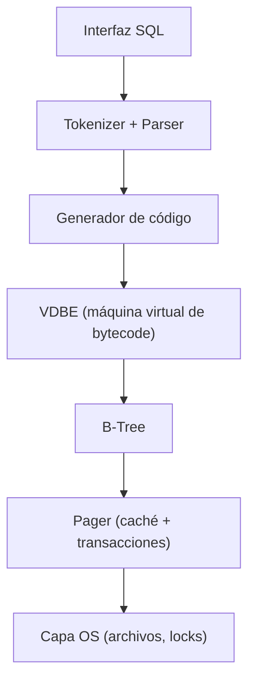

---
tags:
  - Maestría
  - Bases de datos
  - Embebidas
---

# Capítulo 32 — Motores de Bases de Datos Embebidas

!!! abstract "Objetivos de aprendizaje"
    - Estudiar las **internals de SQLite**: *pager*, B-Tree y la VDBE.
    - Comprender **LMDB** (*memory-mapped*) y **RocksDB** (LSM avanzado).
    - Implementar un motor SQL simple integrando lo anterior.

---

## 32.1 Introducción

Una base de datos **embebida** corre *dentro* del proceso de la aplicación (sin
servidor): SQLite, LMDB, LevelDB/RocksDB, DuckDB. Es la categoría de software más
desplegada del mundo —SQLite está en cada móvil, navegador y avión— y casi
siempre escrita en C.

---

## 32.2–32.4 SQLite internals

SQLite es un caso de estudio perfecto de ingeniería en C. Su arquitectura por
capas:



- **Pager** (32.2): gestiona páginas, caché, *journal*/WAL y bloqueo para ACID.
- **B-Tree** (32.3): almacena tablas e índices (cap. 27).
- **VDBE** (32.4): el SQL se **compila a bytecode** ejecutado por una máquina
  virtual (cap. 31). `EXPLAIN` muestra ese bytecode.

```sql
EXPLAIN SELECT * FROM t WHERE id = 5;   -- muestra los opcodes de la VDBE
```

---

## 32.5 LMDB

**Lightning Memory-Mapped Database**: un KV store que mapea el archivo en memoria
(`mmap`) y usa **MVCC** con copy-on-write sobre un B+Tree. Lecturas sin bloqueo y
*zero-copy*, durabilidad por transacciones. Diseño minimalista (~10 K líneas de C)
y altísimo rendimiento de lectura.

---

## 32.6 RocksDB y LSM avanzado

**RocksDB** (Facebook, fork de LevelDB) es un motor **LSM** (cap. 27) de
producción: niveles de compactación, filtros de Bloom por SSTable, *column
families*, compresión. Es el almacén subyacente de muchas bases de datos
distribuidas (CockroachDB, TiKV, Kafka Streams).

---

## 32.7–32.8 En memoria y motor SQL propio

- **En memoria**: Redis, Memcached — estructuras del cap. 11 sin persistencia (o
  con *snapshot*/AOF).
- **Motor SQL simple**: integra parser (cap. 19/33) + B-Tree (cap. 27) + pager +
  un mini-VDBE.

---

## Conexión con la actualidad

SQLite es, según sus autores, **la pieza de software más desplegada de la
historia**: miles de millones de copias activas. Su código C —con una de las
*suites* de pruebas más exhaustivas que existen (cobertura MC/DC del 100 %, miles
de millones de pruebas)— es un modelo de cómo escribir C robusto y portable. En
2024–2025 destacan dos fenómenos: **SQLite en el navegador y en el *edge*** vía
WebAssembly (cap. 24) —proyectos como `wa-sqlite`, `sql.js` y **Cloudflare D1** o
**Turso/libSQL** llevan SQLite a la nube distribuida— y el auge de **DuckDB**, el
«SQLite del análisis» columnar (cap. 27), que ha transformado el análisis de datos
local. Estudiar las *internals* de SQLite es, probablemente, el mejor curso
avanzado de C de sistemas que existe.

---

## Ejercicios

!!! example "Ejercicio 32.1 — EXPLAIN ★★"
    Ejecuta `EXPLAIN` sobre varias consultas en SQLite y describe qué hacen los
    opcodes de la VDBE.

!!! example "Ejercicio 32.2 — Pager con journal ★★★★"
    Extiende tu pager del cap. 27 con un *rollback journal* que garantice
    atomicidad ante un *crash*.

!!! example "Ejercicio 32.3 — KV sobre mmap ★★★★"
    Implementa un KV store sencillo respaldado por un archivo `mmap`-eado, al
    estilo de LMDB.

!!! example "Ejercicio 32.4 — Mini-SQL ★★★★★"
    Integra parser + B-Tree + pager para soportar `CREATE TABLE`, `INSERT` y
    `SELECT ... WHERE` sobre disco. *Proyecto de síntesis* hacia el cap. 40-I.

---

## Referencias

- [SQLite: How It Works](https://www.sqlite.org/arch.html) y *The Untold Story of SQLite* (charla).
- *Database Internals* (Alex Petrov).
- [LMDB design](http://www.lmdb.tech/doc/), [RocksDB Wiki](https://github.com/facebook/rocksdb/wiki).
- *SQLite Database System Design and Implementation* (Sibsankar Haldar).
