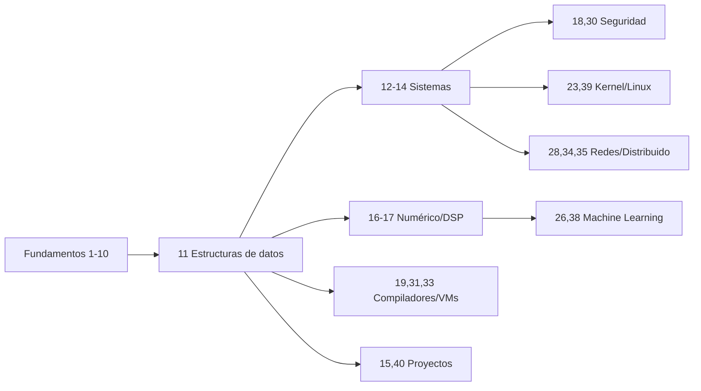

# Cómo estudiar este curso

## Filosofía pedagógica

Este curso parte de una convicción: **C se aprende escribiendo C, rompiéndolo y
arreglándolo**. La teoría aquí no es decorativa, pero siempre desemboca en
código que compilas, ejecutas y modificas. La secuencia recomendada para cada
sección es:

1. **Lee** la teoría de un tirón, sin detenerte en cada detalle.
2. **Compila y ejecuta** los ejemplos tal cual.
3. **Rómpelos a propósito**: cambia tipos, quita un `&`, provoca un *buffer
   overflow* bajo AddressSanitizer y lee el diagnóstico.
4. **Resuelve los ejercicios** sin mirar la solución.
5. **Vuelve a la teoría** con las preguntas que te surgieron.

## Ritmo sugerido

| Perfil | Dedicación | Duración estimada |
|--------|-----------|-------------------|
| Estudiante a tiempo completo | 20 h/semana | 4–5 meses |
| Profesional en activo | 6 h/semana | 10–12 meses |
| Repaso intensivo | 40 h/semana | 6–8 semanas (caps. selectos) |

No es obligatorio hacer los 40 capítulos en orden. Los capítulos **1–10 son
prerrequisito de todo lo demás**. A partir del 11, los itinerarios se ramifican:



## Cómo usar la parte práctica

Cada ejercicio indica su **dificultad** (★ a ★★★★) y, cuando procede, ofrece
una **pista** desplegable y los **criterios de evaluación** que usarías en una
revisión por pares (*peer review*). No te saltes los ejercicios marcados como
*proyecto acumulativo*: construyen sobre el código de capítulos anteriores.

!!! tip "Cuaderno de bitácora"
    Mantén un `BITACORA.md` por capítulo donde anotes: qué te costó, qué
    *undefined behavior* descubriste y un fragmento de código que te gustaría
    recordar. Es la mejor herramienta de consolidación que existe.

## Higiene de compilación obligatoria

Compila **siempre** con avisos máximos. Considera cada *warning* un error hasta
demostrar lo contrario:

```bash
gcc -std=c17 -Wall -Wextra -Wpedantic -Wshadow -Wconversion \
    -fsanitize=address,undefined -g programa.c -o programa
```

- `-Wall -Wextra -Wpedantic`: avisos esenciales.
- `-fsanitize=address`: detecta accesos fuera de límites y *use-after-free*.
- `-fsanitize=undefined`: detecta *undefined behavior* en tiempo de ejecución.

## Evaluación

- **Autoevaluación**: ejercicios al final de cada capítulo.
- **Proyectos de módulo**: capítulos 15 y 40.
- **Portafolio final**: publicación en GitHub con CI, pruebas y documentación
  (ver [Capítulo 40](../capitulos/capitulo-40.md)).
